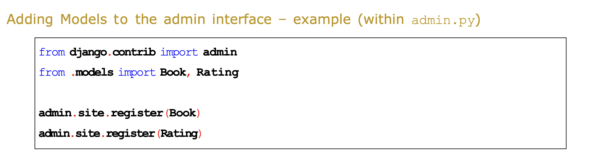

# Workshop 2
## Defining the model
To build the model, the first step is to define how the data is going to be organised and then use this to help build the  models.\ 
\
Start by establishing what data you expect to be in the database and then use Django models to specify and organise the data.\
\
Revision, we are building a blog website, thus the data we will have includes:
- Post-title
- Description
- Publication date
- Tag (keyword describing the post)
- Slug (URL component)

## Migrations in Django
What is the purpose of migrations in Django?\
The purpose of 'migrations' in Django is to propagate (save) changes made to your models, into the database schema (CRUD Operations). 

## Creating models in Django
1. To create a model, create a Python class named after the model by editing models.py in the **App's** directory.

## Admin and Superusers
1. Creating a superuser\
Run the terminal command:
`python3 manage.py createsuperuser` 

There are two main things required for use within admin to make it useful:
1. Models - these define the data structures to be used
2. Actions - these allow us to manipulate data in instances of our models

By adding additional functions to `admin.py`, we can create functions that will CRUD one or more of our Model instances. 

## Adding models to the Admin Interface
With Django, it does not know of the models in any of the apps until you `register` them in the admin app.\
Once they have been registered however, we can then use CRUD operations on any instances of the models.\
\
To register a model, we must call the `admin.site.register` function, an example of this can be found below.\

## Templates
Add a folder named `templates` in the app directory to store the HTML templates. 

## Dot and Double Dot notation
This is used in the presentation layer to retrieve attribtutes. \
Double dots are used to retrieve foreign keys.